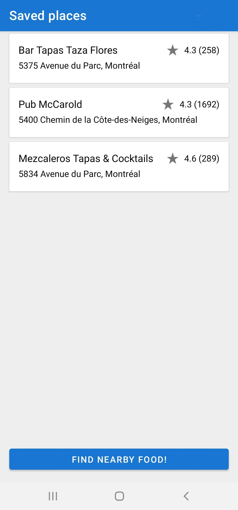
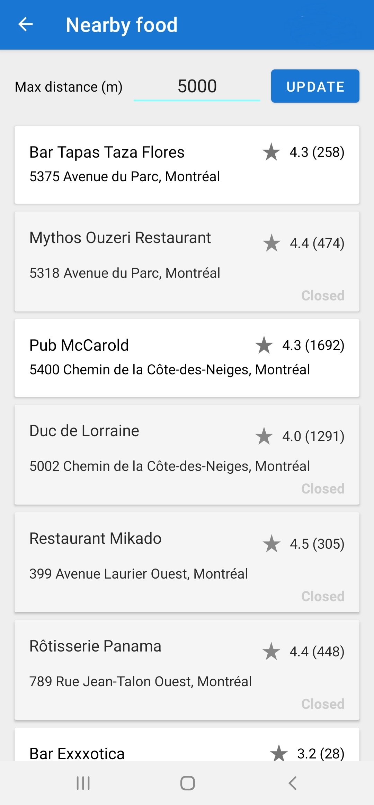
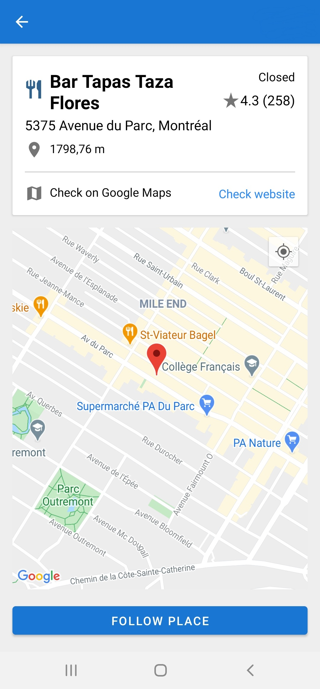

# Find Food

Using Find Food you can find and save locally nearby Cafes, Bars and Restaurants! This app is built with MVVM architecture and uses Places API, Maps SDK, Kotlin and Coroutines.

## Getting Started

To run this project you need to get API key from [Places API](https://developers.google.com/maps/documentation/places/web-service/overview?hl=vi) and from [Maps SDK](https://developers.google.com/maps/documentation/android-sdk/overview) and store them on Environment Variables

*MacOS
```
export PLACES_API_KEY=[YOUR_PLACES_API_KEY]
export MAPS_API_KEY=[YOUR_MAPS_SDK_KEY]
```
*Windows
```
setx PLACES_API_KEY [YOUR_PLACES_API_KEY]
setx MAPS_API_KEY [YOUR_MAPS_SDK_KEY]
```

## Screens: ##

<p float="left">
  
  
  
</p>

### Libraries used
Lifecycle extensions, Room, Retrofit, Moshi, Glide, Koin.

## References
[Places API](https://developers.google.com/maps/documentation/places/web-service/overview?hl=vi)

[Maps SDK](https://developers.google.com/maps/documentation/android-sdk/overview)

[Android Architecture starring Kotlin Coroutines, Jetpack (MVVM, Room, Paging), Retrofit and Dagger 2](https://proandroiddev.com/android-architecture-starring-kotlin-coroutines-jetpack-mvvm-room-paging-retrofit-and-dagger-7749b2bae5f7)

[Android Architecture Blueprints v2](https://github.com/android/architecture-samples)
